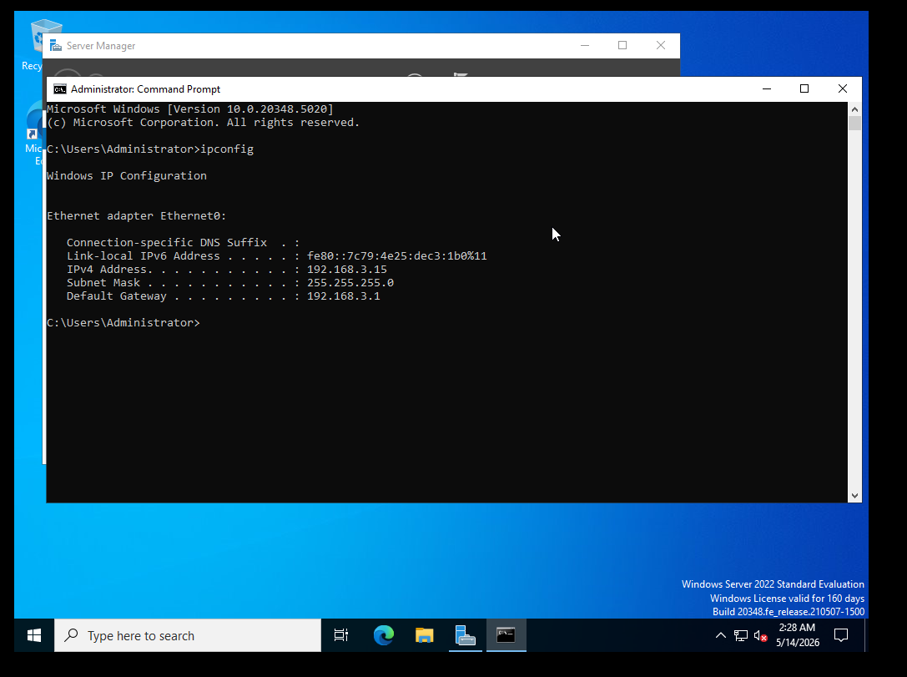
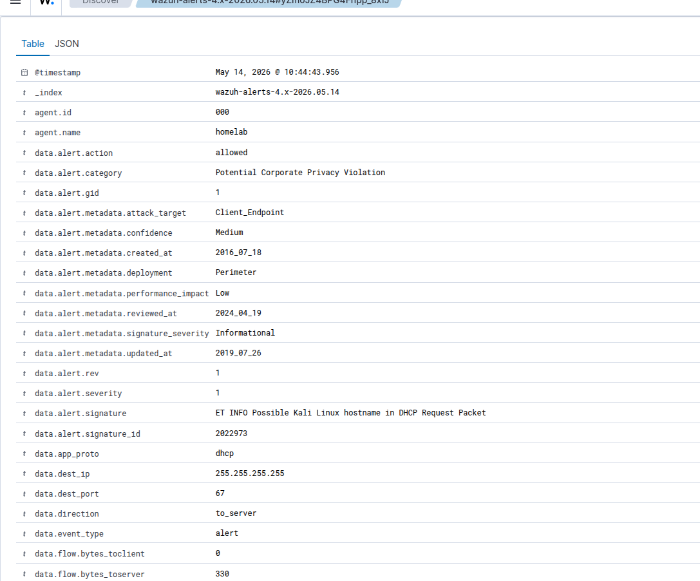
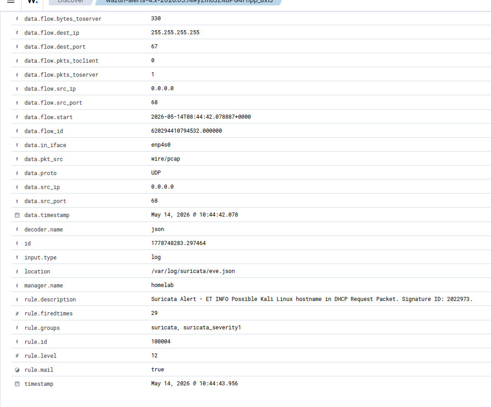
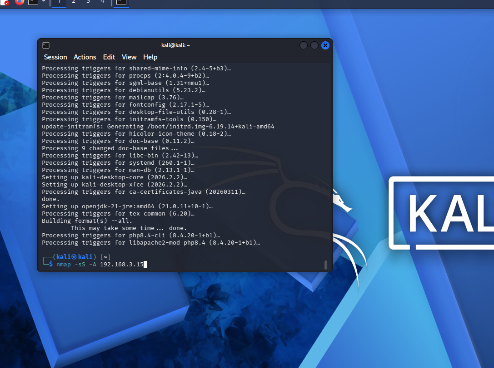
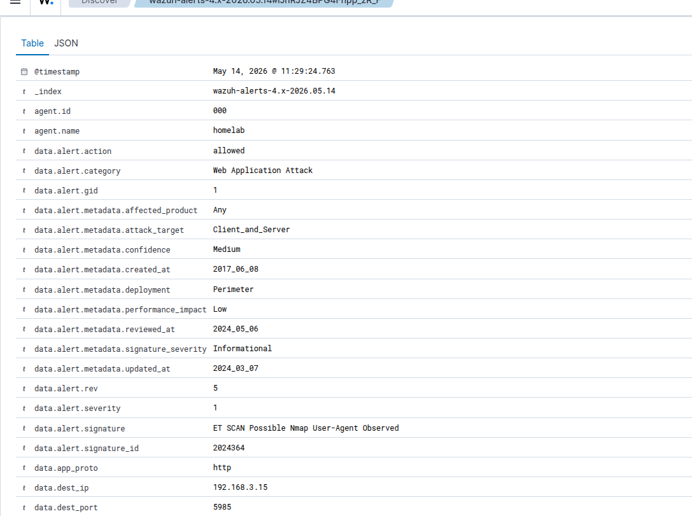
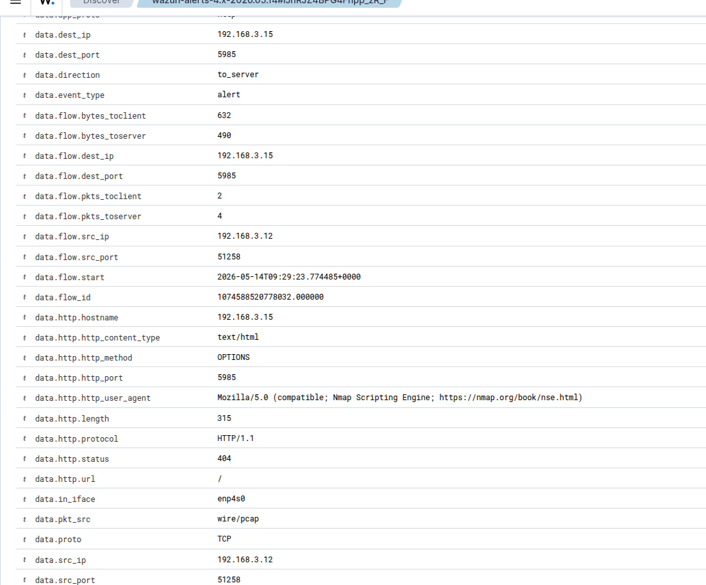
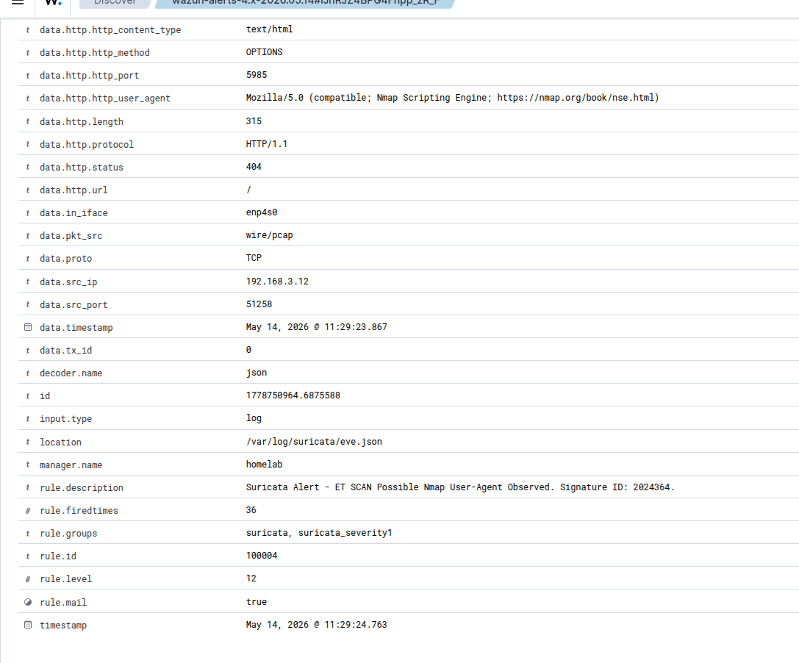
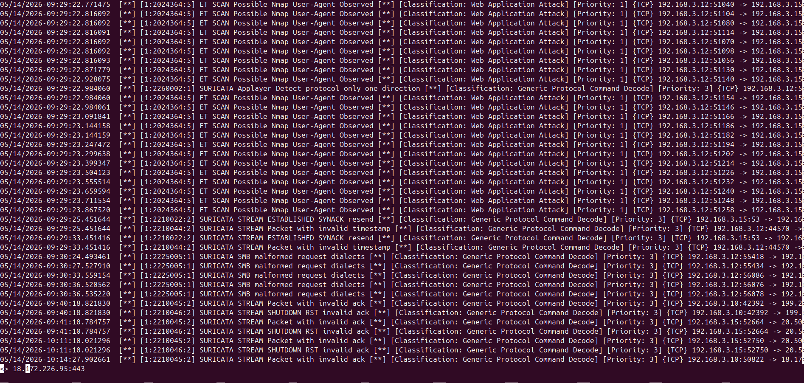

# Incident Report — 2026-05-14
## Unauthorized Kali Host — Active Reconnaissance Against Windows AD Server

---

## Incident Summary

| Field | Details |
|---|---|
| Incident ID | INC-2026-05-14-001 |
| Date | May 14, 2026 |
| Severity | HIGH |
| Status | Resolved |
| Attacker IP | 192.168.3.12 (Kali Linux VM) |
| Target IP | 192.168.3.15 (Windows Server 2022 AD) |
| Detection Tools | Suricata → Wazuh |
| Total Alerts | 2 (bundled) |
| Incident Type | Unauthorized Device + Active Reconnaissance |

---

## Attack Timeline

```
10:44:42  — Kali host connects to network, DHCP lease acquired
              Suricata fires: ET INFO Possible Kali Linux hostname in DHCP Request
              
10:44 - 11:29 — Attacker remains silent on network (~45 minutes dwell time)

11:29:22  — Active nmap reconnaissance begins against 192.168.3.15
              Suricata fires: ET SCAN Possible Nmap User-Agent Observed
              Nmap Scripting Engine probes port 5985 (WinRM)
              SURICATA SMB malformed request dialects fires on port 445
```

---

## Environment

- **SIEM:** Wazuh 4.x
- **IDS:** Suricata 7.x (SPAN port via Ugreen CM933)
- **Attacker:** Kali Linux VM (192.168.3.12) on Librem laptop
- **Target:** Windows Server 2022 AD VM (192.168.3.15)
- **Exercise type:** Authorized red team simulation

---

## Victim — Windows Server 2022 AD (192.168.3.15)



---

## Alert 1 — ET INFO Possible Kali Linux Hostname in DHCP Request

| Field | Value |
|---|---|
| Alert ID | 1778748283.297464 |
| Timestamp | May 14, 2026 @ 10:44:42.078 |
| Tool | Suricata → Wazuh |
| Wazuh Rule ID | 100004 |
| Suricata SID | 2022973 |
| Rule Level | 12 |
| Priority | HIGH |
| Source IP | 192.168.3.12 (Kali Linux) |
| Destination IP | 255.255.255.255 (DHCP broadcast) |
| Protocol | UDP / DHCP |
| Rule fired | 29 times |
| Mail triggered | Yes (ServiceNow ticket created) |

**Description:** Suricata detected the string "kali" in the DHCP hostname field of a broadcast request. This indicates an unmodified Kali Linux installation connected to the network and requested an IP address.

### Wazuh Dashboard — Alert Detail





### Investigation

- Alert observed in Wazuh SIEM under high priority alerts
- Source IP 192.168.3.12 sent a DHCP request to the broadcast address with hostname containing "kali"
- Suricata flagged this via signature 2022973 (ET INFO Possible Kali Linux hostname)
- Cross-referenced with subsequent alerts — same IP later performed active nmap reconnaissance

### Verdict
✅ **True Positive** — Kali Linux host connected to network, confirmed attacker machine

### MITRE ATT&CK
| Technique | ID | Description |
|---|---|---|
| Hardware Additions | T1200 | Unauthorized device connected to network |
| Network Service Discovery | T1046 | Preceded active reconnaissance from same host |

### Action Taken
- **Escalated** — Attacker received a DHCP lease without any Layer 2 access controls in place
- Source IP blocked on access switch
- MAC filtering enabled on switch post-incident
- Security gap identified: no 802.1x authentication on access switch

### Analyst Notes
- An unmodified Kali Linux host announces itself via DHCP hostname — a classic attacker opsec failure
- In a real environment this would trigger immediate isolation of the port the device connected to
- **Security gap:** The access switch on subnet 192.168.3.0/24 had no 802.1x or MAC filtering configured, allowing the rogue device to obtain a DHCP lease freely
- **Correlation:** This alert preceded multiple ET SCAN Nmap alerts from the same source IP, confirming active reconnaissance was in progress

---

## Alert 2 — ET SCAN Possible Nmap User-Agent Observed

| Field | Value |
|---|---|
| Alert ID | 1778750962.6735662 |
| Timestamp | May 14, 2026 @ 11:29:22.479 |
| Tool | Suricata → Wazuh |
| Wazuh Rule ID | 100004 |
| Suricata SID | 2024364 |
| Rule Level | 12 |
| Priority | HIGH |
| Source IP | 192.168.3.12 (Kali Linux) |
| Destination IP | 192.168.3.15 (Windows AD Server) |
| Destination Port | 5985 (WinRM) |
| Protocol | TCP / HTTP |
| HTTP User-Agent | Mozilla/5.0 (compatible; Nmap Scripting Engine) |
| HTTP Method | OPTIONS / GET |
| HTTP Status | 404 |
| Rule fired | 36 times |
| Mail triggered | Yes (ServiceNow ticket created) |

**Description:** Suricata detected the Nmap Scripting Engine user-agent string in HTTP traffic directed at the Windows AD server. The scan targeted port 5985 (Windows Remote Management — WinRM), indicating the attacker was probing for remote command execution capability.

### Attacker Terminal — Nmap Scan Initiated



### Wazuh Dashboard — Alert Detail







### Suricata fast.log — Raw Alert Output



### Investigation

- Multiple nmap scan alerts observed in Wazuh under high priority alerts from 192.168.3.12
- Kali host connected to network at 10:44 and remained silent for approximately 45 minutes before beginning active reconnaissance at 11:29
- Nmap Scripting Engine (`-sC` flag) actively probed port 5985 (WinRM) — testing for remote command execution capability on the AD server
- SMB malformed request dialects also fired on port 445 — nmap service version detection (`-sV`) sending non-standard SMB probes
- After filtering all traffic from 192.168.3.12, no other network activity was found besides the initial DHCP request and the nmap scan — consistent with targeted, deliberate reconnaissance

### Verdict
✅ **True Positive** — Authorized red team simulation, active reconnaissance confirmed

### MITRE ATT&CK
| Technique | ID | Description |
|---|---|---|
| Network Service Discovery | T1046 | nmap scan against AD server |
| Remote Services: WinRM | T1021.006 | NSE probing port 5985 for remote execution |

### Action Taken
- **Escalated** — Access switch requires immediate 802.1x and/or MAC filtering
- Source IP 192.168.3.12 blocked on switch
- MAC filtering enabled during investigation

### Analyst Notes
- The 45-minute dwell time between network connection and active scanning suggests deliberate, methodical behavior rather than automated scanning tools
- Nmap NSE targeting port 5985 (WinRM) indicates the attacker was specifically testing for remote PowerShell/command execution access to the Domain Controller — this would represent critical risk if successful
- **Correlation:** Alert 1 (DHCP) → 45 min silence → Alert 2 (nmap) → SMB malformed (same scan) forms a complete recon kill chain
- **Security recommendation:** 802.1x port authentication on the access switch would have prevented the attacker from obtaining a DHCP lease entirely, stopping this attack at the initial access stage

---

## Full Attack Chain — MITRE ATT&CK

```
T1200 Hardware Additions
    └── Rogue Kali device connects to switch
            ↓
T1046 Network Service Discovery  
    └── nmap -sS -A scan against 192.168.3.15
            ↓
T1021.006 Remote Services: WinRM
    └── NSE probing port 5985 for remote execution capability
```

---

## Security Gaps Identified

| Gap | Risk | Recommendation |
|---|---|---|
| No 802.1x on access switch | Any device can connect and get DHCP | Implement 802.1x port authentication |
| No MAC filtering | Rogue devices not blocked at Layer 2 | Enable MAC address filtering/whitelisting |
| WinRM (5985) exposed | Remote command execution possible if credentials obtained | Restrict WinRM access via firewall rules |

---

## Lessons Learned

1. **Kali announces itself** — default hostname in DHCP is a detectable opsec failure. Real attackers change their hostname before connecting.
2. **Dwell time is significant** — 45 minutes of silence after connecting before scanning is deliberate behavior. Always check what a host was doing before it triggered an alert.
3. **Layer 2 controls matter** — all the SIEM detection in the world doesn't stop a rogue device from connecting if the switch has no access controls.
4. **Port 5985 is a high-value target** — WinRM access to a Domain Controller is game over in most environments. This should be firewalled and monitored aggressively.
